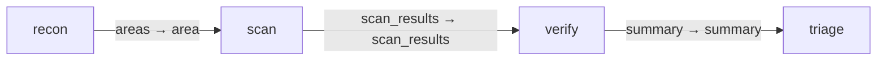

# review_graph

A frozen fixture copy of the `code_review` graph pack (gents-ai/packs,
`packs/gents/code_review`, copied from commit `a3bba2bff` on branch
`feat/packs-out-of-gents`, HEAD `782b7f8` at capture time), for graph-pack
machinery tests: install, revision checks, the loader, and the
graph-pipeline contract tests. It is test data, not a shipped pack, and
drifts from the official pack by design.

Internal ids are unchanged from the source pack (graph id `code-review`,
capability/task/behavior ids `review-*`, and every schema), so tests written
against the real pack's shape keep working against this fixture. Prompts are
trimmed to a few lines; no plan is shipped, so install always compiles fresh.

## Configuration

Four behaviors (`review-recon`, `review-scan`, `review-verify`,
`review-triage`) bound to the `coordinator`, `worker` and `verifier`
inference slots, same as the source pack. Capabilities scope their allowed
caller to `${GENTS_PACK_AGENT_DID}`. The fixture ships no inference backend
or profile; a test supplies the three slot bindings at install time through
`GraphPackageInstallBindings`.

## Usage

Packed fresh by `pack_dir` in each test that needs it
(`graph_package::catalog`, `pack_archive`, `pack::loader`, and the
graph-pipeline contract tests); never installed outside a test's own
throwaway node.

<!-- pack-topology:start -->

<!-- pack-topology:end -->
