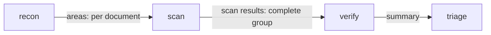
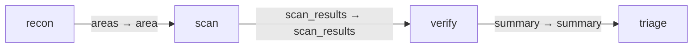

# Code review

Reusable reconnaissance, parallel scanning, verification and triage graph.
Install with `gents pack install code_review --home <home>` and run with
`gents graph run code_review --repo <repo> --base <base> --head <head>`.

## Configuration and authority

Roles inherit the initialized home's model/backend/profile unless explicitly
bound with `--bindings`. Review capabilities are read-only. Review output is
evidence, not permission to merge or modify the reviewed source.

## Inputs, outputs and completion

The `review` entry consumes CodeReviewJob. The terminal contracts require a
triage report and bound the finding set; zero findings is distinct from missing
completion evidence. Task goals retain work across early provider completion.
Use `gents graph watch`, `result`, and `cancel` to operate durable runs.

## Graph

## Verification and history

The runtime package catalog/compiler tests validate the bundled assets and
contracts. See `../grok_tui_port/run_history.md` for the production Grok review
case study and the evidence-pagination and durable-goal improvements.

## Declared topology

Compiled capability edges.

<!-- pack-topology:start -->

<!-- pack-topology:end -->
