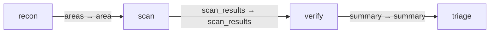

# Code review

Reusable reconnaissance, parallel scanning, verification and triage graph.
Install with `gents pack install code_review --home <home>` and run with
`gents graph run code_review --repo <repo> --base <base> --head <head>`.
Use the same home and principal for installation and execution. Bind the three
declared slots to profiles already configured for that principal:

```sh
gents pack install code_review --home ./.gents --agent-did "$REVIEW_AGENT_DID" \
  --preview \
  --inference-slot coordinator=claude-coordinator \
  --inference-slot worker=glm-worker \
  --inference-slot verifier=grok-verifier
gents pack install code_review --home ./.gents --agent-did "$REVIEW_AGENT_DID" \
  --inference-slot coordinator=claude-coordinator \
  --inference-slot worker=glm-worker \
  --inference-slot verifier=grok-verifier
gents graph run code_review --home ./.gents --agent-did "$REVIEW_AGENT_DID" \
  --repo . --base origin/main --head HEAD --watch
```

Set `REVIEW_AGENT_DID` to the principal running in that home. These commands
require the runtime and pack from the same config generation.
The verification stage currently needs a macOS runtime with `sandbox-exec` for
its configured scratch-write sandbox. Unsupported hosts report a policy error.

## Configuration and authority

The graph requests read-only workspace authority. Verification can write
scratch artifacts through its configured bash tools; reviewed source remains
read-only. Review output is evidence, not permission to merge. Inference resolves
through each stage's Task -> Behavior -> the user profile bound to its named
slot. The pack declares `coordinator` for recon/triage, `worker` for parallel
scans, and `verifier` for adversarial verification. Installation creates no
inference configuration and fills each document's owner from the requested
`--agent-did`; behavior, context, tools,
tasks, capabilities and the intent inherit that explicit installation owner.
Capabilities explicitly permit that installation owner through
`${GENTS_PACK_AGENT_DID}`, which the common loader binds to `--agent-did`.
Empty caller lists deny access. The authored documents and their references live
in `pack_config.json`; prompt files remain literal sidecars. Connectivity,
credentials, model selection, effort, sampling, execution, and concurrency stay
on the selected user profiles and backends.

## Inputs, outputs and completion

The `review` entry consumes CodeReviewJob. The terminal contracts require a
triage report and bound the finding set; zero findings is distinct from missing
completion evidence. Task goals retain work across early provider completion.
Use `gents graph watch`, `result`, and `cancel` to operate durable runs.

## Verification and history

The runtime package catalog/compiler tests validate the bundled assets and
contracts. See `../grok_tui_port/run_history.md` for the production Grok review
case study and the evidence-pagination and durable-goal improvements.

## Declared topology

Compiled capability edges.

<!-- pack-topology:start -->

<!-- pack-topology:end -->
