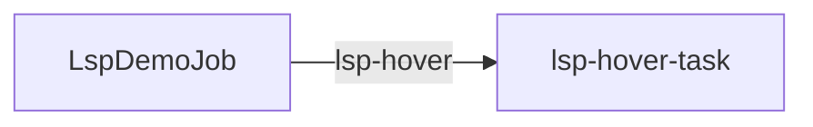

# Pack: rust-analyzer through the native `lsp` tool

Least-privilege coding surface: ReadOnly file tools rooted at **this Gents
repository**, bash and every other tool off, `enable_lsp: true`. The model
has to call `lsp` against rust-analyzer and answer two
checkable questions about the runtime crate.

This pack is **not** a CI gate. Required CI still says no live rust-analyzer.
Run it locally when `rust-analyzer` is on `PATH` and the DeepSeek box (or
another OpenAI-compatible endpoint) is reachable.

```bash
# rust-analyzer must resolve on PATH
rust-analyzer --version

# From the repo root so init.tool_root `.` is this Gents tree
gents pack run lsp_rust

# Or pin an absolute workspace
GENTS_LSP_WORKSPACE=/abs/path/to/gents \
  gents pack run lsp_rust --keep-home
```

`experiment.json` asks `gents pack run` for a **readonly** ceiling rooted
at `tool_root` and then checks persisted `AgentToolCall` rows (symbols and
both hovers). The ignored live test loads this same pack prompt and
lsp_config. It first runs `unscripted_prompt.md`, which gives the model no
path, action order, retry instruction, or expected wording beyond the
semantic question. Useful semantic results and a factually correct answer—
not status or a completed-but-empty call—prove the server actually started
and answered:

```bash
GENTS_LIVE_LSP=1 cargo test -p gents --features live-e2e --test e2e_live \
  lsp_live_model_uses_rust_analyzer \
  -- --ignored --test-threads=1 --nocapture
```

`workspace/` remains a tiny isolated crate used by the rust-analyzer unit
test. The live pack and e2e point at the real Gents tree.

## Layout

| Path | Role |
| --- | --- |
| `workspace/` | Tiny Rust lib for the offline rust-analyzer unit test |
| `tool_selections/lsp_readonly/` | ReadOnly files + `enable_lsp`; bash off; root is the repo |
| `tasks/lsp_hover_task/` | Deterministic prompt asks checkable semantic questions |
| `event_triggers/lsp_hover/` | Fires on `LspDemoJob` create |

## Tools

| Behavior | Tools | Why |
| --- | --- | --- |
| lsp-coder | `read_file` / `list_files` / `glob` / `grep` (ReadOnly) + `lsp` | rust-analyzer needs a file root; no writes, no bash |
# Installation

Install configuration with `gents pack install lsp_rust --home <home>` or
exercise the scenario with `gents pack run lsp_rust`. See the usage and tool
requirements below before enabling compiler or shell access.

## Declared topology

Document-trigger edges; task writes and host callbacks are described above.

<!-- pack-topology:start -->

<!-- pack-topology:end -->
