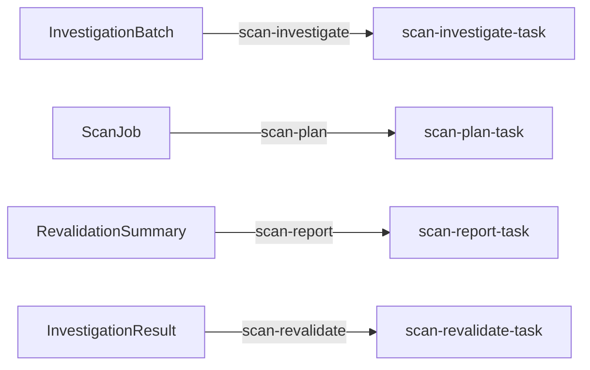

# Whole-codebase security scan pack

This pack scans the **entire tree**, not a diff. It differs from
`code-review` (reviews a PR diff) and `repo-maintenance` (a cleanup round)
in scope, and it borrows deepsec's economics: a free mechanical regex
pre-scan decides *what* gets investigated, and paid model stages decide
*how deep*.

```text
[runner kickoff: ported scan engine runs, output embedded in the single seed doc]

ScanJob ──▶ scan-plan (planner)
              candidates arrive via {{ doc.candidates }}
              → writes N × InvestigationBatch (each stamps expected_total = N)
InvestigationBatch ──▶ scan-investigate × N
              self-contained evidence packet via {{ doc.* }}
              → CandidateFinding* + exactly 1 InvestigationResult sentinel
[N sentinels, fire_mode per_group] ──▶ scan-revalidate (single barrier consumer)
              {{ group.docs }} is the sentinel set; load rows with
              query_candidate_finding (bound to CandidateFinding)
              → 1 FindingVerdict per candidate + 1 RevalidationSummary
                (written last)
RevalidationSummary ──▶ scan-report
              load rows with query_finding_verdict
              → confirmed Finding* + 1 ScanReport
```

Four triggers, all `event_kind: created`: `scan-plan` (on `ScanJob`),
`scan-investigate` (on `InvestigationBatch`, `fire_mode: per_document`,
parallel), `scan-revalidate` (on `InvestigationResult`, `fire_mode:
per_group`, `correlation_field: run_id`, `expected_count_field:
expected_total`), `scan-report` (on `RevalidationSummary`). This is the
same trigger-edge shape `code-review` established: closed cardinality
stamped at fan-out, a sentinel-gated barrier, a write-last summary
contract, and an exact candidate-to-verdict bijection enforced by the
runner.

## Self-sufficient carrier documents

Trigger edges still deliver their local payload through prompt template
injection (`{{ doc.* }}`, `{{ group.docs }}` for the sentinel barrier).
But typed finding and verdict **rows** are read with single-collection
surface query tools — not the generic `defra_query` console, and not JSON
copies stuffed into sentinels. `scan-revalidate` gets `query_candidate_finding`
(bound to `CandidateFinding`); `scan-report` gets `query_finding_verdict`
(bound to `FindingVerdict`). Each is bound to exactly the collection that
stage needs, with `run_id` runtime-filled from correlation and hidden
from model input — the model can call the tool but never sees or sets the
run identity. Sentinels stay thin (`InvestigationResult`,
`RevalidationSummary`) the same way `code-review` keeps `ScanResult`
thin: they carry counts, not payload, and the next stage loads the real
rows itself.

Payload discipline throughout is **complete inventory, truncated
evidence**: caps never silently drop items. A path+slug inventory line is
always complete; only excerpts truncate, and every truncation is recorded
as an overflow count in the same document.

## Matchers

The pre-scan is a Rust port of deepsec's regex matcher registry
(`crates/gents-cli/src/commands/demo/secscan/matchers.rs`), curated for a
Rust/polyglot repo. Each matcher has a noise tier — `precise` sorts first
into the candidate payload, `noisy` last — and its own discovery test that
asserts its example snippet fires.

| Slug | Tier | Flags |
| --- | --- | --- |
| `secrets-exposure` | precise | Hardcoded API keys, tokens, or passwords in source. |
| `graphql-injection` | precise | GraphQL built with `format!` interpolation — verify `escape_graphql_string` is applied to every interpolated value. |
| `defra-empty-array` | precise | Empty `[]` literal inside a DefraDB mutation string — types as `JsonArray` and corrupts nillable array columns; emit `null` instead. |
| `secret-in-fallback` | precise | Secret env var read with a hardcoded fallback value. |
| `insecure-crypto` | precise | Weak hash algorithms (MD5/SHA-1) in a security context. |
| `secret-in-log` | normal | Credentials or tokens flowing into log statements. |
| `command-injection` | normal | Shell invocation with interpolated or `-c` arguments — verify inputs cannot reach the shell. |
| `webhook-handler` | normal | Webhook ingress — verify signature/authenticity checks before trusting the payload. |
| `path-traversal` | noisy | Filesystem join with request/user-derived path segments — verify canonicalization/containment. |
| `missing-auth` | noisy | HTTP route registration — verify authentication/authorization wraps the handler directly. |

`graphql-injection` and `defra-empty-array` are gents-native additions,
not part of deepsec's upstream taxonomy: they encode this repository's
two documented sharp edges (see `CLAUDE.md`) — every GraphQL
interpolation must pass `escape_graphql_string`, and a DefraDB mutation
must never emit an empty `[]` literal. Both are `precise` tier because
they check syntactic project law rather than a fuzzy security heuristic,
and both feed straight into `scan-investigate`'s system prompt, which
tells investigators to treat violations as real findings.

## Stages

- **scan-plan** batches candidate files deepsec-style — roughly five
  files per batch, precise-tier first, related files grouped — and
  decides the complete batch list and immutable `expected_total` before
  its first write. Read-only file tools only; no shell, no network.
- **scan-investigate** (× N, parallel) gets one self-contained batch:
  read-only file tools, native `lsp`, unrestricted bash rooted at the
  scan root (targeted `cargo`/tests, `git log`/`git blame`), and
  background process tools for long commands. It writes
  `CandidateFinding` rows, then exactly one `write_investigation_result`
  as its final write.
- **scan-revalidate** is the single barrier consumer: it fires once all N
  `InvestigationResult` sentinels for the run exist, loads every typed
  candidate with `query_candidate_finding`, re-inspects each one (file
  context, git history — "was this fixed?"), and writes one
  `FindingVerdict` per candidate plus one `RevalidationSummary` whose
  `confirmed_count` + `refuted_count` balance the candidate set. No
  `defra_query`, no network.
- **scan-report** loads every verdict with `query_finding_verdict` and
  publishes one `Finding` row per confirmed verdict plus exactly one
  `ScanReport`. No shell, no file tools, no network, no `defra_query`.

## Env retargeting

```bash
export GENTS_SCAN_ROOT=/path/to/repo
export GENTS_SCAN_ENDPOINT=http://127.0.0.1:8000/v1
export GENTS_SCAN_MODEL=GLM-5.2
export GENTS_SCAN_MIN_BATCHES=4
export GENTS_SCAN_MAX_BATCHES=24
export GENTS_SCAN_MAX_PAYLOAD_CHARS=49152
```

`GENTS_SCAN_ROOT` roots the pre-scan, the file tools, and bash for the
investigate/revalidate stages, and defaults to `.`. `GENTS_SCAN_ENDPOINT`
and `GENTS_SCAN_MODEL` retarget the one shared inference backend (default
`GLM-5.2` at `http://100.87.27.25:8000/v1`, `concurrency: 8`) that all
four stages use, so batch fan-out never exceeds eight in-flight requests
regardless of batch count. `GENTS_SCAN_MIN_BATCHES` /
`GENTS_SCAN_MAX_BATCHES` bound how many `InvestigationBatch` rows the
planner may create; `GENTS_SCAN_MAX_PAYLOAD_CHARS` bounds the pre-scan
payload embedded in the seed `ScanJob` before excerpts truncate and,
beyond that, inventory itself drops to path-only lines counted in
`overflow_count`.

## Run it

```bash
gents pack run security_scan
```

Everything a run produces lands under `packs/security_scan/runs/<job_id>/`:
`results.json` with the confirmed `Finding` rows and the `ScanReport`,
`meta.json` with stage request ids and signed request-version provenance,
and timeline/adapter projection artifacts under `projections/`.

## Attribution

The investigation and revalidation prompt structure, the severity
vocabulary, and the matcher taxonomy are adapted from
[vercel-labs/deepsec](https://github.com/vercel-labs/deepsec),
Apache License 2.0, © 2026 Vercel, Inc. and contributors (see the
upstream NOTICE file). The scan engine here is an independent Rust
implementation of the same scan → process → revalidate → report shape.

## Declared topology

Document-trigger edges; task writes and host callbacks are described above.

<!-- pack-topology:start -->

<!-- pack-topology:end -->
