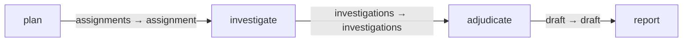

# Web deep research

Reusable planning, investigation, adjudication and reporting graph.
Install with `gents pack install web_deep_research --home <home>`.
Use `gents pack show web_deep_research` for entry/result contracts and external
dependencies, then `gents graph run web_deep_research --help` for run inputs.
Set `GENTS_WEB_RESEARCH_MODEL` to a model advertised by the selected endpoint.
The endpoint defaults to `http://127.0.0.1:8080/v1`; override it with
`GENTS_WEB_RESEARCH_ENDPOINT`.

## Configuration and authority

Inference resolves through each task's behavior and profile. The shared backend,
sampling, execution, contexts, exact MCP tool names, datastore surfaces, tasks,
capabilities and graph intent are authored once in `pack_config.json`.
Installation binds their owner to the requested principal. Declared external
services must be provisioned by the operator; installing a pack does not execute
dependency install commands. The host's tool ceiling still constrains every
configured capability.

## Inputs, outputs and completion

The entry research job drives a plan and parallel investigations. Adjudication
feeds the final research result. The graph result contracts, not model prose,
define successful completion. Watch, inspect results, or cancel through the
ordinary `gents graph` commands.

## Verification and history

Bundled catalog and compiler tests validate the assets and graph contracts.
Keep future run summaries and issue links here; do not commit raw node homes
or credentials.

## Declared topology

Compiled capability edges.

<!-- pack-topology:start -->

<!-- pack-topology:end -->
