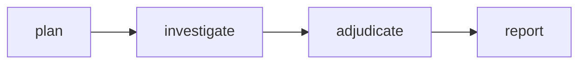
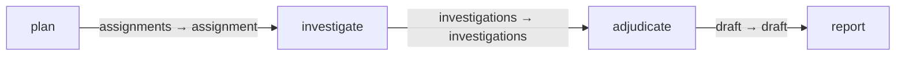

# Web deep research

Reusable planning, investigation, adjudication and reporting graph.
Install with `gents pack install web_deep_research --home <home>`.
Use `gents pack show web_deep_research` for entry/result contracts and external
dependencies, then `gents graph run web_deep_research --help` for run inputs.

## Configuration and authority

Role bindings inherit the initialized home's inference configuration unless
overridden at install. Declared external services must be provisioned by the
operator; installing a pack does not execute dependency install commands.
Tool selections and datastore surfaces in this folder are the authority
declarations, constrained by the host's configured tool ceiling.

## Inputs, outputs and completion

The entry research job drives a plan and parallel investigations. Adjudication
feeds the final research result. The graph result contracts, not model prose,
define successful completion. Watch, inspect results, or cancel through the
ordinary `gents graph` commands.

## Graph

## Verification and history

Bundled catalog and compiler tests validate the assets and graph contracts.
Keep future run summaries and issue links here; do not commit raw node homes
or credentials.

## Declared topology

Compiled capability edges.

<!-- pack-topology:start -->

<!-- pack-topology:end -->
